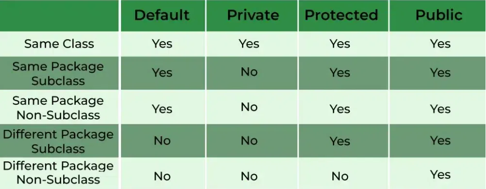
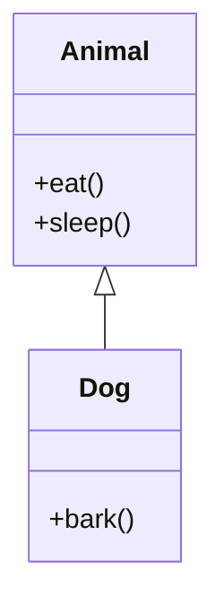
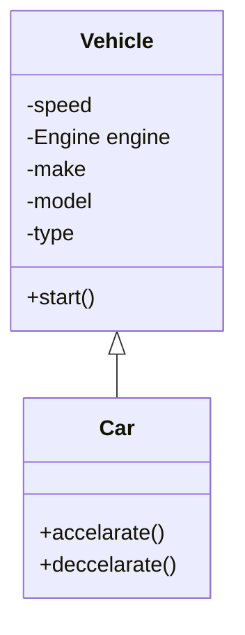

# Encapsulation
- Encapsulation in Object - Oriented programming hides data away from the user through classes, in these classes data is being bundled together in a single unit to satisfy some buisness requirement

## Class
- In OOP a class are blocks of code that allows user to define a specific type of behaviour and purpose through attributes and methods to fufil some buisness requirements, classes are also known as the building blocks for objects which are used throughout Java to create instances of classes in programs
    - These instances are able to access the properties/attributes of the class and various methods related to them
- The reason for creating classes is to allow programmers to create their own user defined dataTypes or collections to satisfy the needs of consumers based on data

## How does a class implement Encapsulation
1. Data bundling, bundling data in classes 
2. Exposing of bundled data through getters and setters, and restricting the access of attributes through field access modifiers 


## Data bundling, bundling data with classes
- A neat way of encapsulating any buisness logic or properties of a section of code from the main program is through classes where all the buisness logic is being implemented within the class and not inside the program, programs import the classes such that objects are able to be instantiated and the object can be utilised by the program 

## Field Access Modifiers
- Private: The private field in java specifies that the attribute or method within the class can only be accessed inside the scope of the class. Thus, if you try to access a private attribute in the main program. It is illegal. 
  > Solution: Use getters and setters which are public methods exposes and retrieves or modifies the private attribute in the class

- Public: The public field in java specifies that this attribute or method within the class can be accessed beyond the scope of where its defined in the class itself. Which means i can access it in other classes in same or different packages or inside the main program itself. 

- Protected: The protected field in java specifies that the attribute or method within the class can only be accessed by its subclasses (classes that inherits from the parent class) or classes within the same package where the class is defined 

-  Default: The default field in java specifies that the attributes and methods within the class can only be accesed by classes in the same package or within the same scope of the class where its defined, (This is used when no access modifiers are specified on the attributes or methods of the class )


Summary of what has been discussed in the prev section


Example 1: Class with attr defined as private 

``` Java

package com.example.isaac.Rectangle;
class Rectangle
{
    private int length;
    private int height;

    public Rectangle(int l, int h){
        this.length = l;
        this.height = h;
    }

    public int calculateArea(){
        return length x height;
    }
}

// Not in the same package and in the same class user/java
import com.example.isaac.Rectangle;
class Main(){
    import user/java/class
    static int main(String[] args){
        Rectangle rectangle = new Rectangle(5,10);
        System.out.println("This is the rectangle height: " + rectangle.height)
        // a Compilation error occurs 
    }
}
```

Example 2: Class defined with protected attributes 

``` Java

package com.example;

public class Parent {
    protected int protectedNumber = 100;  // Protected attribute

    protected void display() {  // Protected method
        System.out.println("Protected Number: " + protectedNumber);
    }
}

import com.example.Parent
public class Child extends Parent{
    public void accessProtected() {
        // Accessing protected members from the Parent class
        System.out.println("Accessing protectedNumber: " + protectedNumber);
        display(); // Calling protected method
    }
}

// main program in different package
package com.test.Main;
public class Main{
    import com.example.* // import all fiels in the package

    public static void main(String[] args){
        // create an instance of the parent class
        Parent parent = new Parent();
        // try to access the protected modifier 
        System.out.println(parent.protectedNumber);
        // Compilation error 

        Child child = new Child();
        child.accessProtected()
        // No compilation error as protected attributes can be accessed by subclasses 
    }
}

```


# Inheritance

- Inheritance in object oriented programming represents an Is-A relationship between classes.

Example 1: Dog and Animal class



Example 2: Vehicle and Car


- In both examples we see that the relationship between the classes specified are valid examples of inheritance (is-A) relationship

- A dog can sleep and eat so it inherits these methods from the Animal class however it is able to specializ the animal class behaviour by defining a bark method

- A car likewise has all the data attributes in a vehicle class (inherits them) but it also able to specialise the behaviour of the vehicle class in the methods defined 


## Implementing the Car and Vehicle Class

``` java 
package com.example;

class Engine
{
    private boolean isRunning;
    private int horsepower;
    public Engine(int horsepower)
    {
        this.horsepower = horsepower
        this.isRunning = false
    };

    public void start()
    {
        if(!isRunning)
        {
            isRunning = true;
            System.out.println("Engine started");
        }
        else
        {
            System.out.println("Engine already started");
        }
    };

    public void stop()
    {
        if(isRunning)
        {
            isRunning = false;
            System.out.println("Stopping the engine");
        }
        else
        {
            System.out.println("Cannot stop engine that has not started");
        }
    }
}
class Vehicle{
    private int speed;
    private Engine engine;
    private String make;
    private String model;

    // Getters and setters 
    public Engine getEngine(){
        return this.engine;
    }
    public setEngine(Engine e){
        this.engine = e;
    }
    public int getSpeed(){
        return this.speed;
    }
    public setSpeed(int currSpeed){
        this.speed = currSpeed
    }
    public String getMake(){
        return this.make;
    }
    public setMake(String mk){
        this.make = mk;
    }

    public String getModel(){
        return this.model;
    }

    public setModel(){
        this.model = model;
    }

    public Vehicle(){};

    // parameterized constructor
    public Vehicle(Engine e, String m, String mo){
        this.e = e;
        this.make = m;
        this.model = mo;
    }
}

class Car extends Vehicle{
    private int mileage
    Car(int s, Engine e, String m, String mo)
    {
        super(speed,enginer,make,model)
    }

    public void accelerate(int s)
    {
        speed += s
        System.out.println("The " + m + " car has accelerated to " + s)
    }

    public void deccelerate(int s)
    {
        speed -= s
        System.out.println("The " + m + " car has deccelerated to " + s)
    }
    
}


```
- In this example we created the car and vehicle class, the vehicle class is a parent class (base class) in which the derrived class car inherits from, this means that it will have all the methods and properties of the vehicle class on top of its other methods
- This relationship is known as inheritance, in inheritance we create an Is-A relationship between classes in which we create a generalised class through generalising common behaviours and attributes of a set of classes, from there each individual class can be further specialised to support their own expected behaviour

- In order for subclasses to have access to the superclass constructor (things are passed in) the keyword super is used , super is a keyword to access the superclass object of the subclass


> Take note that though inheritance may seem like a right fit for classes it depends on the question whether it is truly an is-A relationship between classes. For instance a Car and Engine , Student and Course and so on. In these cases composition or aggregation is favoured


Expanding on OO design 
- If we were to add a new buisness requirements in which i want to include vehicles with no engine (non conbustable engines) we would have to rewrite a huge portion of the code, as all vehicles must have an engine, what if a vehicle does not have ( electric car ).
- Hence, a suggested approach would to be to make Engine an interface or abstract class which can then be implemented by the concrete classses of different engine types (Open closed principle)


