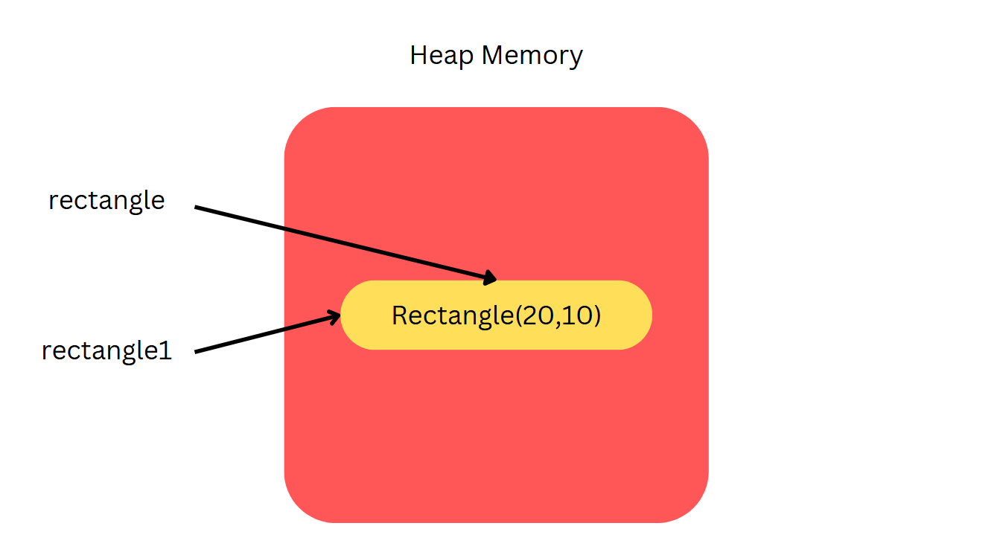

# References 
- In Object Oriented Programming we know that programmers are able to define their own data types and encapsulate certain buisness logics, properties or fields. These are known as classes 
- We know that whenever we instantiate a class we create a new instance of that class this is known as an object 

``` Java

public class Rectangle{
    int length;
    int breadth;
    Rectangle(){} // non - parameterized constructor 
    // parameterized constructor
    Rectangle(int l, int b){
        this.length = l;
        this.b = b;
    }
    int calculateArea(){
        return length * breadth;
    }
}

Shape rectangle = new Shape()
```
## What is actually happening here (with regards to how the memory is being ustilised)


- In this image we see that a new memory address (location) is being assigned in the heap memory of the program to the newly created object

## How do we access what is created in the heap memory (newly created object)
- Remember in C++ we used a pointer variable (reference variable) that stores the memory address of the object in the stack or heap which is determined if we use dynamic or statically allocated memory 
    - new keyword (heap dynamic mem alloc) or &varName (static , stack)

- In Java that same thing applies but the reference variable is automatically created, memory management is not being exposed to the developer instead it is handled by the JVM (Java - Virtual - Machine)


> Tips to note on references ⚠️
> Class, Interface, Objects, Array, Enums, Annotations, User-Defined types are of the reference type in Java
> The default value for a reference variable is null
> In order to access properties (methods) and fields associated with the reference variable the . dot operator is used

Example 1: Accessing properties of the Shape Reference
- Both the main class and Rectangle class are in the same package and hence need not be imported 
``` Java
// Shape class 
public class Rectangle {
    int length;
    int breadth;
    Shape(){} // non - parameterized constructor 
    Rectangle(int l, int b){
        this.length = l;
        this.b = b;
    }
    int calculateArea(){
        return length * breadth;
    }
}

// Main Program 
public class Main{
    static void main(String[] args){
        Rectangle rectangle = new Rectangle(20,10);
        System.out.println("The height of the rectangle is: ", rectangle.calculateArea());
    }
}
```

Example 2: Creating two reference variables that references the same object

```Java
// given the shape class above 

// Main program 
public class Main{
    static void main(String[] args){
        Rectangle rectangle = new Rectangle(20,10);
        Rectangle rectangle1 = rectangle
    }
}
```

Picotorial Representation 


1. We see that when we assign a new reference object with the other reference object we are not assigning it that reference object instead the object it is pointing to

2. We conclude that Java passes by value

3. Both rect1 and rect are completely seperate reference variables created outside the heap (stack) now they both point to the same reference object Rectangle(20,10), when the object state change it will be refelcted by both reference variables.

4. If we wanted to create a copy of the object (they are two seperate objects not pointing to the same thing in heap), we need to do a deep copy of the object

### How does the assignment operator work here 🤔
- First associativity is from left to right, so since when passing an object being referenced by a referenced variable is a pass by value. rectangle1 will now be assigned the object (referenced to)
  
- It returns the object that is being referenced from rectangle and assign it to reference variable rectangle1 as well


### More examples demonstrating reference variables 

Example 1: Reassigning a reference variable to a new object being referenced (chnaging reference variables)

``` Java
public class Rectangle{
    int length;
    int breadth;
    Rectangle(){} // non - parameterized constructor 
    // parameterized constructor
    Rectangle(int l, int b){
        this.length = l;
        this.b = b;
    }
    int calculateArea(){
        return length * breadth;
    }
}

public class Main{
    static void main(String[] args){
        Rectangle rect1 = new Rectangle(20,10);
        Rectangle rect2 = rect1;
        System.out.println("Rectangle 2 length is " + rect2.length + " and bredath is " + rect2.breadth);
        // reassignment of rect1 reference variable to another object
        Rectangle rect2 = new Rectangle(6,3);
        System.out.println("Rectangle 2 length is " + rect2.length + " and bredath is " + rect2.breadth);
}
```

What can be concluded from this example
- We see that when rect1 is reassigned to a new object rect2 atill references the rectangle object that has length 20 and breadth 10 hence the output for both print atatements are the same

Explanation: When we assign a reference variable to another reference variable we see that what is being passed is the value of the object that is being referenced hence changing refernce A will not affect reference b as they are two different variables in heap memory

Example 2: Updating the referenced object variable through a method 


``` Java
public class Rectangle{
    int length;
    int breadth;
    Rectangle(){} // non - parameterized constructor 
    // parameterized constructor
    Rectangle(int l, int b){
        this.length = l;
        this.b = b;
    }
    int calculateArea(){
        return length * breadth;
    }

   
}

public class Main{
    static void main(String[] args){
         // create a new method that assigns new length and breadth
         changeDim(Rectangle B){
             B.length = 18
             B.breadth = 5
         }
         Rectangle A = new Rectangle(20,70)
         System.out.println("Area is " + area);
         int area = A.calculateArea()
         changeDim(A);
         System.out.println("Area is " + area);
    }
}
```
- At first the reference variable A is intialised to point to a reference object of Rectangle(20,70) hence the first output is ``` Area is 200 ```
- However when we pass the reference variable A to the method a copy of the reference variable is created an assigned to B (temp var), both A and B point to same object so when B.length and B.breadth is assigned to a new breadth and length.
  - We can observe that A reference variable object will now have a length of 18 and a breadth of 15
  - Resulting in two different outputs for calulateArea method
 


Example 3 : Pass an Array into a method 
``` Java

import java.io.*;
class Demo {
	int arrayUpdate(int[] formalArray)
	{
		formalArray[2] = 99;
		formalArray[4] = 77;
		return 0;
	}
}
class Main {
	public static void main(String[] args)
	{
		Demo d1 = new Demo();
		int[] actualArray = { 1, 2, 3, 4, 5 };

		for (int items : actualArray)
			System.out.print(items
							+ " , "); // printing array

		System.out.println();
		d1.arrayUpdate(actualArray);
		System.out.println();

		for (int items : actualArray)
			System.out.print(items
							+ " , "); // printing array
	}
}
```
- we see that when we pass an array as a reference into the function we are able to update the elements of the array.
  - For instance as seen from the updateArray function which updates the value of the first and second element to the int 99 and 77 respectively.

Reason for this 
- When we first initialised the array actualArray a reference to the memory location / addr of the first element of the array is created, similar to C and C++ we access the actual element of the array reference using the [] operator. Enabling us to mutate the values stored at the specific index 


